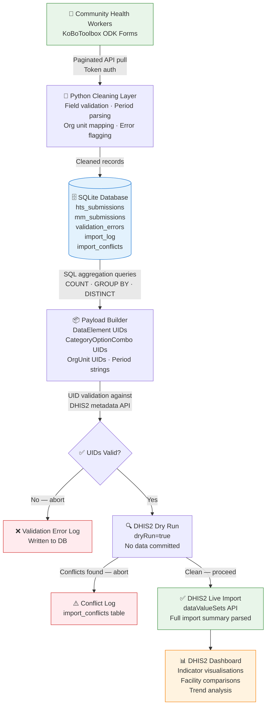

<div align="center">

# Alex Gatongo Arasa
### MEAL Professional | Clinical Officer | Health Informatics Specialist

*I design M&E systems, manage health program data, and ensure evidence reaches decision-makers — on time and with confidence*

[](https://linkedin.com/in/alex-arasa-316b54214)
[](https://gatongoalex.netlify.app)
[](#certifications)

</div>

---

## Who I Am

I am a registered Clinical Officer and MEAL practitioner based in Nairobi, Kenya. I have worked at the facility level in HIV/PMTCT and community health programs — which means I understand what data means at the point of care, not just at the point of reporting.

That clinical grounding shapes everything I build. When I design an M&E framework, configure DHIS2 indicators, or structure a data collection tool, I do it with a clear understanding of what community health workers can realistically capture, what program managers actually need to see, and what donors require for accountability.

The projects in this portfolio are not engineering exercises. They are responses to real problems in Kenya's health data ecosystem — fragmented reporting, delayed aggregation, and M&E frameworks that measure outputs without tracking outcomes.

---

## ⚡ What I Bring to a MEAL Role

- 📋 **M&E framework design** — Theory of Change, log frames, indicator matrices, DQA protocols, and PEPFAR MER alignment (TX_CURR, TX_PVLS, HTS_TST, KP indicators) for HIV, PMTCT, and NCD programs
- 📊 **DHIS2 configuration** — data elements, indicators, validation rules, org unit hierarchies, and program dashboards configured end-to-end for Kenya health program contexts
- 🗺️ **GIS and data visualisation** — facility-level malaria burden mapping for Garissa County; indicator dashboards for program performance monitoring
- 🔁 **Data pipeline automation** — eliminated manual CSV aggregation in an HIV/PMTCT program by building an automated flow from KoBoToolbox to DHIS2, reducing data lag and removing human error from the reporting cycle
- 🩺 **Clinical credibility** — active facility-level experience in PMTCT and HTS means my M&E systems reflect how care is actually delivered, not how it looks on paper
- 🎓 **6 DHIS2 Academy certifications** — Aggregate Customization, Data Analysis, Data Capture & Validation, Event Configuration, Planning & Budgeting, and Tracker

---

## 🔁 Featured Project: Automated HIV/PMTCT Reporting Pipeline

> *From community health worker to national dashboard — without the three-week wait*

In most NGO health programs, data collected by community health workers takes weeks to reach program managers. It moves through paper registers, manual Excel compilation, and email chains — by the time it informs a decision, the moment has passed.

This project automates that entire cycle for an HIV/PMTCT program, pulling structured data from KoBoToolbox, validating and aggregating it, and pushing clean indicator values directly into DHIS2. Program managers see updated dashboards within hours of data submission, not weeks.

**The M&E problem it solves:** Delayed, manually aggregated data that cannot support adaptive management.
**The technical approach:** A validated, auditable pipeline with error logging at every stage so data quality is traceable, not assumed.

### Data Flow



### What Makes This Pipeline Professional-Grade

| Layer | What it does | Why it matters |
|---|---|---|
| **SQL storage** | All raw submissions stored in SQLite before aggregation | Creates an auditable data trail — every record, every run |
| **SQL aggregation** | Indicators computed via GROUP BY queries, DISTINCT for deduplication | Reproducible, queryable, not locked in pandas memory |
| **UID validation** | Checks all dataElement and orgUnit UIDs against live DHIS2 metadata | Catches category combo mismatches before any import attempt |
| **Dry run** | `dryRun=true` pre-check — DHIS2 validates without committing | Zero risk of partial imports or silent failures |
| **Import log** | Every run logged to `import_log` with full conflict detail | Program managers have a queryable audit trail |
| **Env credentials** | No hardcoded secrets — all credentials via environment variables | Production-safe, shareable codebase |

### Indicators Tracked

**HTS (Community HIV Testing):** `HTS_TST` · `HTS_TST_POS` · `HTS_REFERRAL` · `HTS_LINKED_30`

**PMTCT / Mentor Mother:** `PMTCT_ENROLLED` · `PMTCT_CASCADE` · `PMTCT_DELIVERY` · `MM_CONTACTS` · `MM_QUALITY` · `EID_ELIGIBLE` · `EID_DONE`

### Tech Stack


📁 **[View pipeline code →](kobo_to_dhis2_pipeline_v2.py)**

---

## 📂 Portfolio Projects

### 🗺️ Garissa County Malaria GIS Burden Dashboard
Facility-level malaria burden mapping for Garissa County using DHIS2 Maps. Visualises case distribution across 5 health facilities, supporting targeted intervention planning in a high-burden arid-zone context.

`DHIS2 Maps` `GIS` `Malaria` `Garissa County`

📁 **[garissa_malaria_gis →](https://github.com/Bitange-Gatongo/garissa_malaria_gis)**

---

### ✅ HMIS Data Quality Assurance Framework
A structured DQA methodology for health management information systems — covering completeness, timeliness, accuracy, and internal consistency checks. Built around PEPFAR DQA standards and Kenya NASCOP reporting requirements.

`DHIS2` `DQA` `PEPFAR` `NASCOP` `KenyaEMR`

📁 **[hmis-dqa-framework →](https://github.com/Bitange-Gatongo/hmis-dqa-framework)**

---

### 💊 NCD Tracker — DHIS2 Programme Configuration
A DHIS2 Tracker programme for non-communicable disease patient follow-up — covering hypertension, diabetes, and chronic respiratory disease. Includes enrolment logic, program rules, indicators, and a facility-level management dashboard.

`DHIS2 Tracker` `NCD` `Program Rules` `Indicators`

📁 **[ncd_tracker_DHIS2 →](https://github.com/Bitange-Gatongo/ncd_tracker_DHIS2)**

---

## 🛠️ Technical Stack

### Health Data Systems


### Programming & Data


### M&E Frameworks & Standards


---

## 🎓 Certifications

| Certification | Issuer | Focus |
|---|---|---|
| DHIS2 Aggregate Customization | DHIS2 Academy | System configuration, data elements, indicators |
| DHIS2 Data Analysis | DHIS2 Academy | Pivot tables, charts, dashboards |
| DHIS2 Data Capture & Validation | DHIS2 Academy | Data entry, validation rules, quality |
| DHIS2 Event Configuration | DHIS2 Academy | Event programs, program rules |
| DHIS2 Planning & Budgeting | DHIS2 Academy | Organisational planning modules |
| DHIS2 Tracker Configuration | DHIS2 Academy | Individual-level program tracking |
| Afya Bora M&E Programme | Afya Bora | Applied M&E for health programs |

---

## ⚙️ Setup — Run the Pipeline Locally

```bash
# 1. Clone the repository
git clone https://github.com/Bitange-Gatongo/Bitange-Gatongo.git
cd Bitange-Gatongo

# 2. Install dependencies
pip install requests

# 3. Set credentials as environment variables (never hardcode)
export KOBO_API_TOKEN="your_kobo_token_here"
export DHIS2_USERNAME="admin"
export DHIS2_PASSWORD="district"
export DHIS2_BASE_URL="http://localhost:8080"   # or your remote instance

# 4. Ensure DHIS2 is running
# Local: Docker on port 8080
# Remote: set DHIS2_BASE_URL to your instance URL

# 5. Run the pipeline
python kobo_to_dhis2_pipeline_v2.py
```

### What the pipeline creates

```
mmi_pipeline.db       ← SQLite database (submissions, aggregations, import logs)
pipeline.log          ← Full run log with timestamps
```

### Query your data after a run

```sql
-- Check import history
SELECT run_at, status, imported, updated, conflict_count
FROM import_log ORDER BY run_at DESC;

-- See all conflicts from the last run
SELECT ic.object, ic.value
FROM import_conflicts ic
JOIN import_log il ON ic.run_id = il.id
ORDER BY il.run_at DESC LIMIT 20;

-- HTS aggregation by period
SELECT org_unit_uid, period, COUNT(*) as hts_tst
FROM hts_submissions
WHERE hts_result != 'declined' AND period IS NOT NULL
GROUP BY org_unit_uid, period;
```

---

## 📍 Context

Based in **Nairobi, Kenya** · Open to remote and field-based roles across East Africa

Currently targeting MEAL Officer, Health Informatics Officer, and HMIS roles with NGOs, UN agencies, and Ministry of Health implementing partners — particularly USAID, Global Fund, and UN-funded programs operating in Kenya.

---

<div align="center">

*"Good health data doesn't just happen. It is designed, cleaned, validated, and structured — before it ever reaches a dashboard."*

**[Portfolio](https://gatongoalex.netlify.app) · [LinkedIn](https://linkedin.com/in/alex-arasa-316b54214) · [Email](mailto:arasalex25@gmail.com)**

</div>
